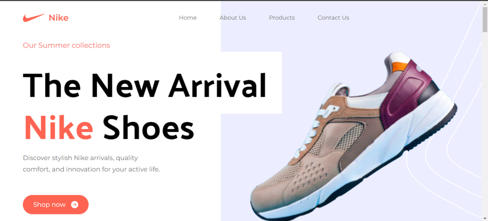

<h1 align="center">E-Commmerce Design</h1>
<p>Welcome to my E-Commerce Design project. This platform showcases an exquisite collection of premium footwear, complemented by exclusive offers that add an extra layer of allure. Foraying into the premium footwear space, this website offers a wide range of Nike shoes that redefine quality and style. From iconic classics to the latest releases, the collection is a treasure trove for shoe lovers. Embarking on a journey of savings and value, the platform provides visitors with a number of exclusive offers and special deals. These attractive options make every purchase not only stylish, but also budget-friendly. It is the React framework that powers the flawless performance of the website. This advanced technology brings pages to life with dynamic interactions, making browsing and shopping a pleasurable experience. The site's aesthetic is a harmonious blend of visual appeal and functionality achieved through the elegant use of Tailwind CSS. This modern CSS framework ensures a consistent and attractive design across all devices. With a responsive design philosophy, the website gracefully adapts to different screen sizes and ensures that attractive visuals and functional elements remain consistent across desktops, tablets and smartphones.</p>
<hr />

<hr />
<h2>🍿 Features </h2>
<ul>    
<li>Super Quality Shoes</li> 
<li>Popular Products</li> 
<li>Special Offer</li>
<li>Responsive</li>
</ul>
<hr />
<h2>🍿 Technologies </h2>
<ul>
<li>ReactJs</li>
<li>Tailwind CSS</li>
</ul>
<hr />
<h2>🍿 How to Run the Website on Your System </h2>
<h3> Step 1: Download and Extract the Code </h3>
<p>First, download the entire website code and extract the ZIP file to a folder on your local system.</p>
<h4>Website Code: https://github.com/BilgeGates/E-commerce-design.git</h4>
<h3>Step 2: Run the Website
</h3>
<p>Open your code editor (such as VS Code) and navigate to the project directory. Then, open a terminal and run the following command:
npm run dev</p>
<p>This will start the application. Open a web browser and navigate to <a href="http://localhost:5173">http://localhost:5173</a> to access the website.</p>  
  
```bash
    npm run dev
 ```
<hr />
<h2>🍿 Demo </h2>
<p> - Check out our live demo at https://e-commerce-design-page.netlify.app/ </p>
